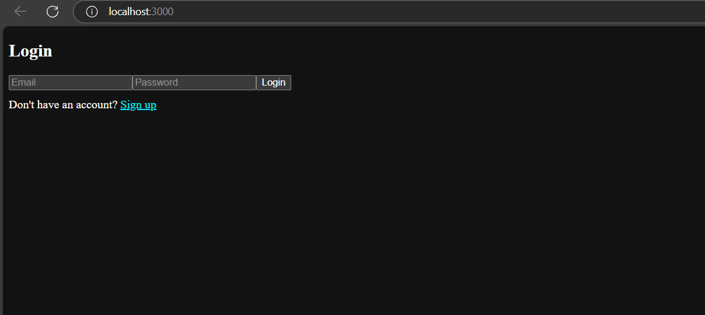
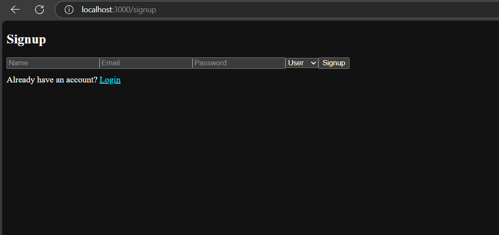
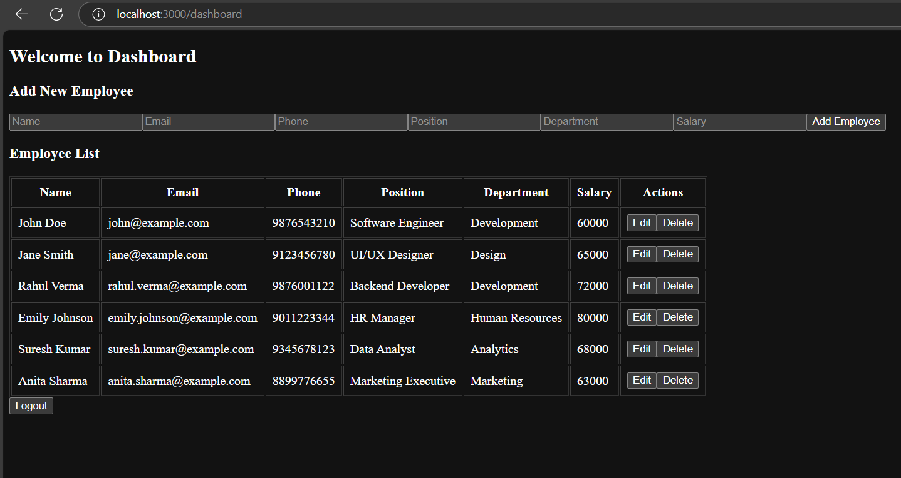
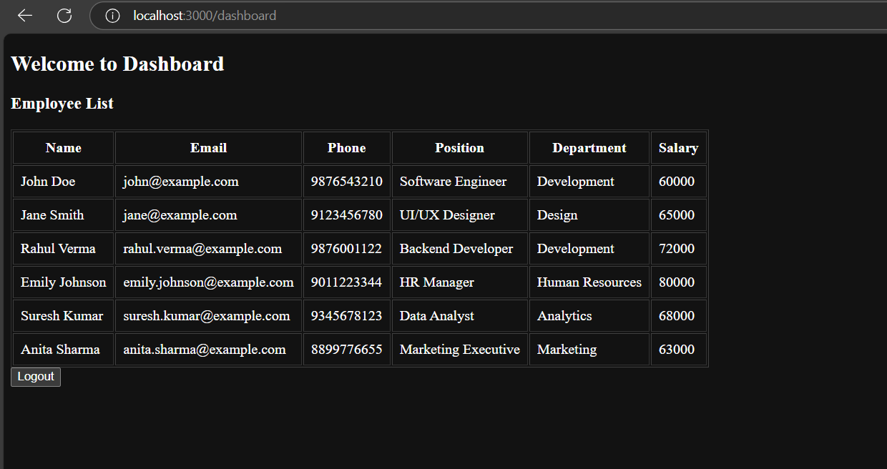

# Employee Management System

A full-stack web application built using the MERN stack that allows administrators to manage employee records with secure authentication and role-based access.

## 🚀 Features

- **User Authentication** (Signup/Login with JWT)
- **Admin & User Roles**
- **Add, View, Update, Delete Employees** (Admin only)
- **Secure API with Token-Based Access**
- **Form Validations & Error Handling**

## 🔧 Tech Stack

- **Frontend:** React, Tailwind CSS, Axios
- **Backend:** Node.js, Express.js, MongoDB
- **Authentication:** JWT, Bcrypt
- **Validation:** express-validator
- **Role Management:** Admin & User

## 📁 Folder Structure

```plaintext
employee-management-system/
│
├── backend/
│   ├── controllers/
│   ├── models/
│   ├── routes/
│   ├── middlewares/
|   ├── .gitignore
|   ├── package-lock.json
|   ├── package.json
│   └── server.js
│  
├── frontend/
|   ├── public
|   |   ├── favicon.ico
|   |   ├── index.html
|   |   ├── logo192.png
|   |   ├── logo512.png
|   |   ├── manifest.json
|   |   └── robots.txt
|   ├── src
|   |   ├── components
|   |   |   ├── Auth
|   |   |   |   ├── Login.js
|   |   |   |   └── Signup.js
|   |   |   ├── Dashboard
|   |   |   |   ├── Dashboard.js
|   |   |   |   └── EmployeeForm.js
|   |   ├── services
|   |   |   └── api.js
|   |   ├── App.css
|   |   ├── App.js
|   |   ├── index.css
|   |   └── index.js
|   ├── .gitignore
|   ├── package-lock.json
|   └── package.json
```

## 🚀 Getting Started

1. **Clone the repository**

   ```bash
   git clone https://github.com/MylapalliYesebu/employee-management-system.git
   cd employee-management-system
   ```

2. **Set up the backend**

   ```bash
   cd backend
   npm install
   npm run dev
   ```

3. **Set up the frontend**

   ```bash
   cd frontend
   npm install
   npm run dev
   ```

## 🔐 Environment Variables

Create a .env file in the backend/ directory and add the following:

``` bash
PORT=5000
MONGO_URI=your_mongodb_uri
JWT_SECRET=your_jwt_secret
```

## 🖼️ Screenshots

**Login Page**


**SignUp page**


**Admin Dashboard**


**User Dashboard**


## 🙌 Acknowledgements

Special thanks to the creators and maintainers of:

- [Express.js](https://expressjs.com/)
- [React](https://reactjs.org/)
- [MongoDB](https://www.mongodb.com/)
- [JWT](https://jwt.io/)
- [bcrypt](https://github.com/kelektiv/node.bcrypt.js)
- [ChatGPT](https://openai.com/chatgpt) – For guidance, debugging, and support throughout development.

## 📚 Learning Purpose

This project was built to strengthen my understanding of:

- 🔐 Implementing user authentication using JWT
- 🔄 Communicating between frontend and backend with Axios
- 🧠 Managing secure user sessions and protected routes
- 📦 Working with environment variables for config management
- 🧩 Structuring full-stack applications using the MERN stack

It serves as a strong foundation for building secure, scalable, and maintainable web applications.

## 🙌 Author

👤 **Mylapalli Yesebu**  
📧 [yesebumylapalli08@gmail.com](mailto:yesebumylapalli08@gmail.com)  
🌐 [GitHub Profile](https://github.com/MylapalliYesebu)

If you liked this project, feel free to connect or star the repo ⭐
